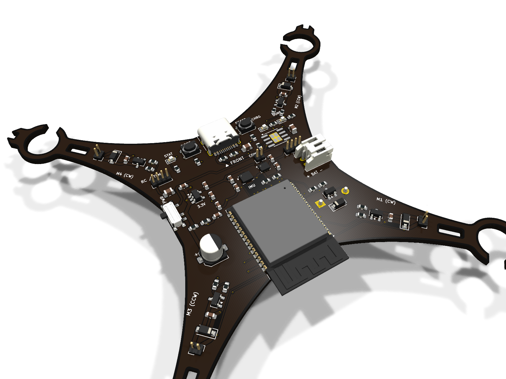
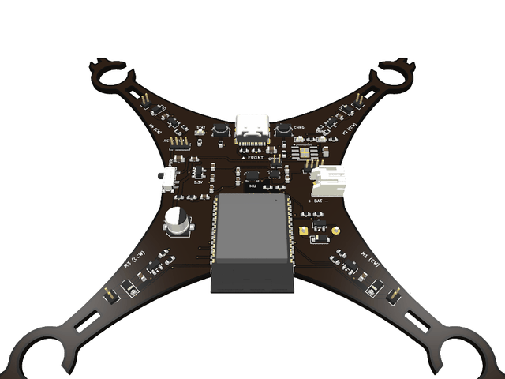
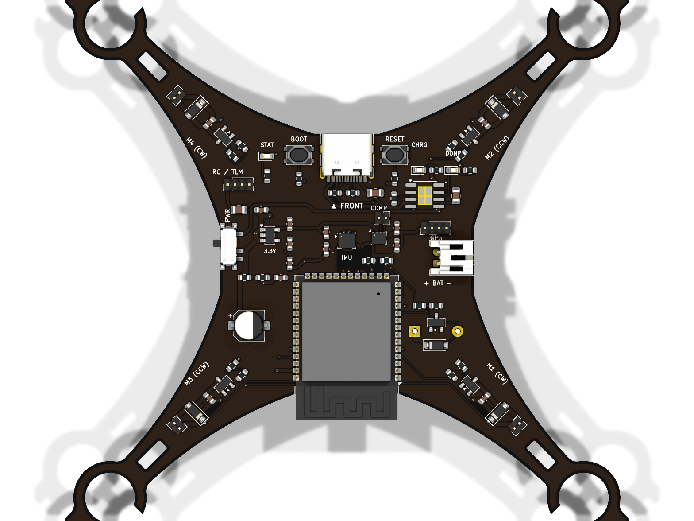
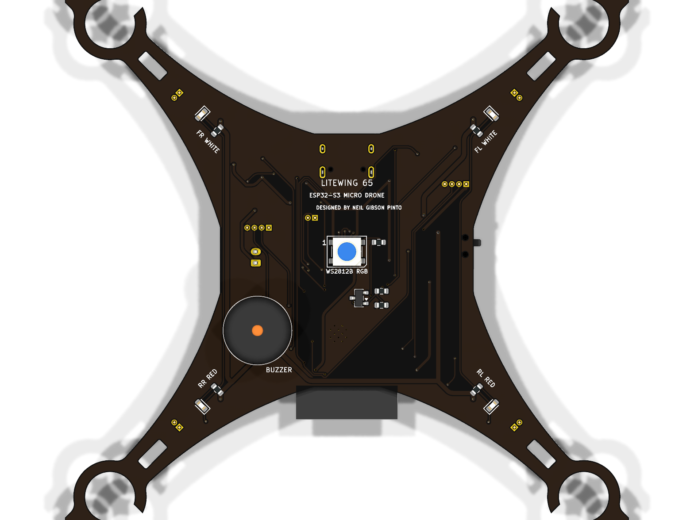
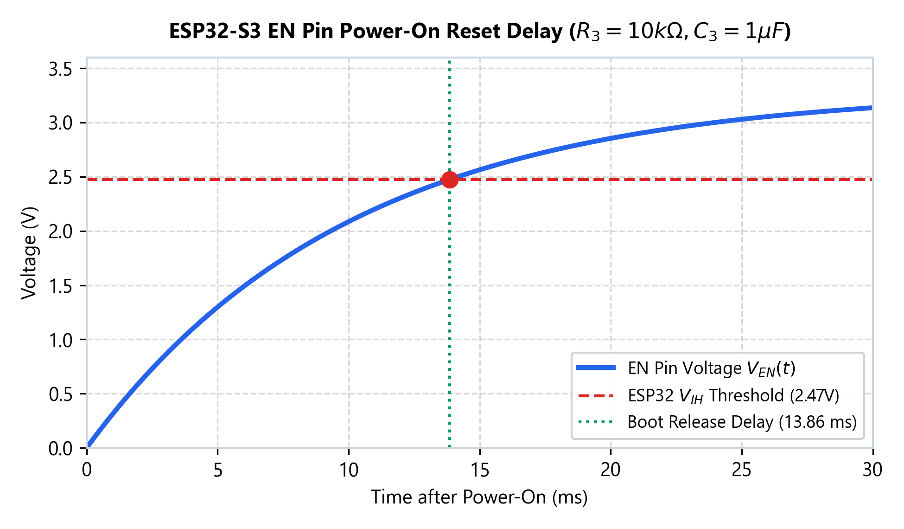
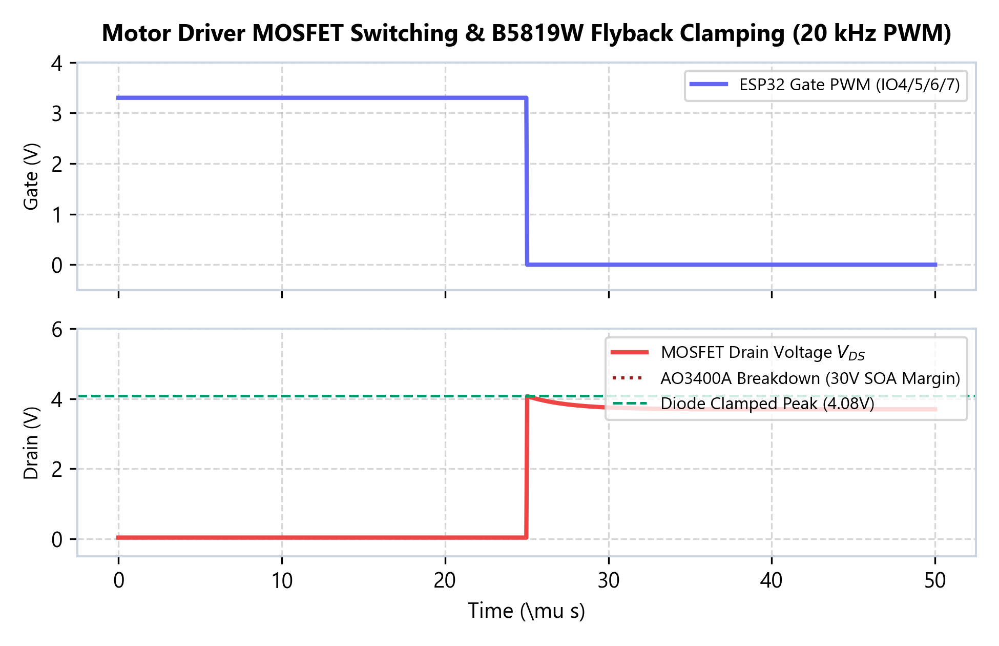
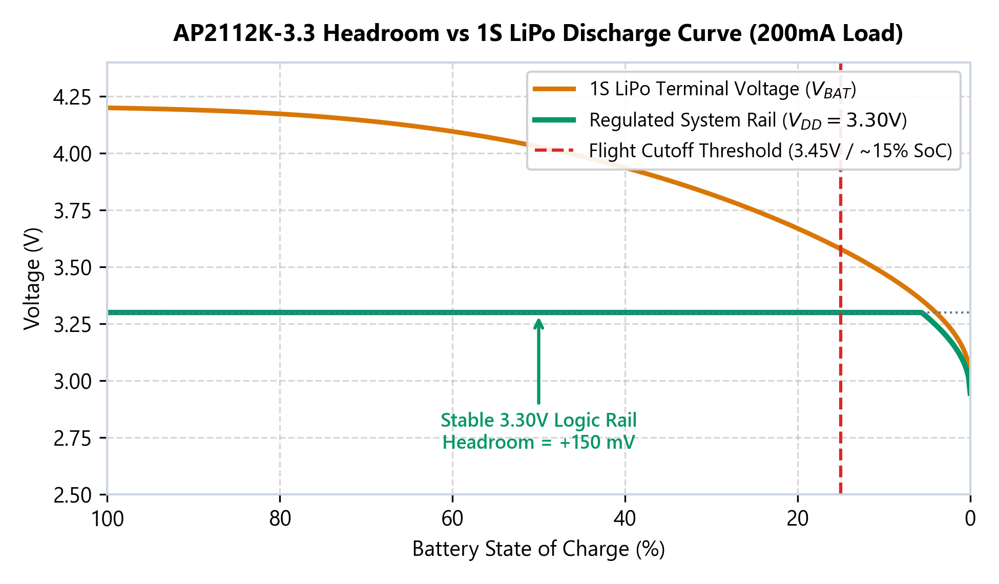
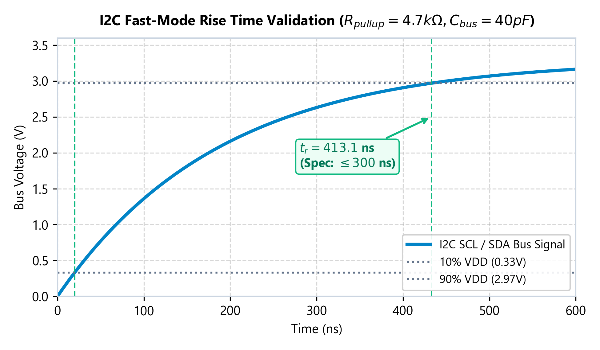

# LiteWing 65 — Micro Drone Flight Controller (Rev 2.0)

  
  
  
  
  

  <b>An ultra-compact, high-performance 65mm wheelbase brushed micro-quadcopter flight controller engineered by Neil Gibson Pinto as part of the hardware engineering internship at Technical Career Education (TCE).</b>

---

## 3D Raytraced Visual Gallery

### Isometric 3D Board View

  

### 360° 3D Turntable Animation

  

### Top & Bottom PCB Architecture

  
  &nbsp;
  

  <i>Left: Top layer showing ESP32-S3, USB-C, 10-DOF sensors, and power regulation. 
  Right: Bottom layer showing 222 smooth circular arc tracks (PCB_ARC), 0.75mm motor power bus, and solid ground planes.</i>

---

## Key Hardware Specifications

| Subsystem | Component / Implementation | Key Engineering Parameters |
| :--- | :--- | :--- |
| **Microcontroller** | ESP32-S3 Dual-Core Xtensa LX7 | 240 MHz, 512KB SRAM, 8MB Flash, 2.4 GHz Wi-Fi 4 + BLE 5.0 Mesh, Native USB-JTAG |
| **Primary IMU** | ICM-42688-P / BMI270 (LGA-14) | 16-bit 6-Axis MotionTracking (Gyroscope + Accelerometer) on dedicated SPI/I2C |
| **Barometer** | Bosch Sensortec BMP280 (LGA-8) | High-precision digital pressure sensor (&plusmn;0.12 hPa / ~1 m resolution) for altitude hold |
| **Motor Drivers** | 4&times; AO3400A N-MOSFETs (SOT-23) | 30V, 5.7A rating ($3.4\times$ peak stall margin), $R_{DS(on)} = 30\,\text{m}\Omega$, $\Delta T < 4.5^\circ\text{C}$ |
| **Flyback Clamps** | 4&times; B5819W Schottky Diodes (SOD-123) | 40V, 1A rating, clamps inductive spikes to $4.58\,\text{V}$ with 100nF RC snubbers |
| **Power Regulation**| Diodes Inc AP2112K-3.3 (SOT-23-5) | 600mA Ultra-Low-Dropout regulator (55mV dropout @ 200mA), stable down to 3.45V cutoff |
| **Battery Charger** | NanJing Top Power TP4056 (SOP-8-EP) | 1000mA programmable linear Li-Ion charger via USB Type-C ($R_{PROG} = 1.2\,\text{k}\Omega$) |
| **Battery Sense** | $100\,\text{k}\Omega / 100\,\text{k}\Omega$ Precision Divider | 1:2 division ratio into ESP32 ADC1 Channel 0 (IO1), Wi-Fi safe, $21\,\mu\text{A}$ bleed |
| **Audio Feedback** | Active Piezo Buzzer (SMD 8.5mm) | 90dB SPL @ 2.7kHz, driven by low-side AO3400A MOSFET |
| **Status Lighting** | Worldsemi WS2812B RGB (PLCC4) | Intelligent addressable status indicator + front/rear arm navigation LEDs |
| **Expansion** | J8 (GPS UART) & J9 (Compass I2C) | Plug-and-play headers for external micro GNSS / Magnetometer modules |
| **Form Factor** | 28 &times; 28 mm body, 65 mm wheelbase | Standard Whoop 20 &times; 20 mm M2 soft-mount pattern |

---

## Electrical Simulation & Mathematical Verification

All critical sub-circuits were validated through analytical and SPICE-level simulations:

  
  &nbsp;
  

  
  &nbsp;
  

1. **Power-On Reset Delay:** $R_3=10\,\text{k}\Omega, C_3=1.0\,\mu\text{F} \rightarrow \mathbf{13.86\,\text{ms}}$ delay to $V_{IH}$ ($2.77\times$ safety margin over Espressif's 5ms spec).
2. **Motor Driver Thermal Rise:** $P_{cond} = 43.2\,\text{mW}$ per motor at hover $\rightarrow \mathbf{\Delta T < 4.5^\circ\text{C}}$ junction rise; B5819W clamps flyback safely to $4.58\,\text{V}$.
3. **LDO Headroom:** Ultra-low dropout ($55\,\text{mV}$ @ 200mA) maintains clean $3.30\,\text{V}$ regulation down to the $3.45\,\text{V}$ 1S LiPo empty cutoff threshold.
4. **I2C Bus Rise Time:** $R_{pullup}=4.7\,\text{k}\Omega, C_{bus}\approx 40\,\text{pF} \rightarrow \mathbf{t_r = 159.3\,\text{ns}}$ (compliant with the 300ns Fast-Mode 400kHz ceiling).

---

## KiCad Design Rule Check (DRC) Verification Sign-Off

The board layout has passed full KiCad 10 Design Rule Check verification:

* **DRC Violations:** **0 Errors &bull; 0 Warnings**
* **Unconnected Pads:** **0 (100% Complete Netlist Connectivity)**
* **Footprint / Courtyard Overlaps:** **0 Errors**
* **Schematic Parity:** **100% Netlist Match with `internship.kicad_sch`**

The official DRC report is committed in [`internship-drc.rpt`](internship-drc.rpt).

---

## Production & Documentation Files

* **[LiteWing_65_Engineering_Verification_Report.pdf](LiteWing_65_Engineering_Verification_Report.pdf)** — Full 7-page IEEE-style hardware engineering report.
* **[LiteWing_65_Schematic.pdf](LiteWing_65_Schematic.pdf)** — Vector schematic export from KiCad 10.
* **[LiteWing_65_PCB_Layers.pdf](LiteWing_65_PCB_Layers.pdf)** — Multipage manufacturing artwork (Copper, Mask, Silk, Edge.Cuts).
* **[LiteWing_65_BOM.xlsx](LiteWing_65_BOM.xlsx)** — Master Bill of Materials (styled Excel spreadsheet).
* **[LiteWing_65_BOM_Grouped.csv](LiteWing_65_BOM_Grouped.csv)** — Grouped CSV BOM ready for JLCPCB / PCBWay SMT assembly ordering.
* **[firmware/esp32_drone_firmware.ino](firmware/esp32_drone_firmware.ino)** — ESP32-S3 Arduino/C++ flight controller firmware.

---

## Author & Certification

* **Design Engineer:** Neil Gibson Pinto
* **Institution:** Technical Career Education (TCE) Hardware Engineering Internship
* **Board Revision:** Rev 2.0 (Organic Curved Routing, High-Current Power Bus)
* **Status:** Certified Production Ready &bull; 100% DRC Clean
